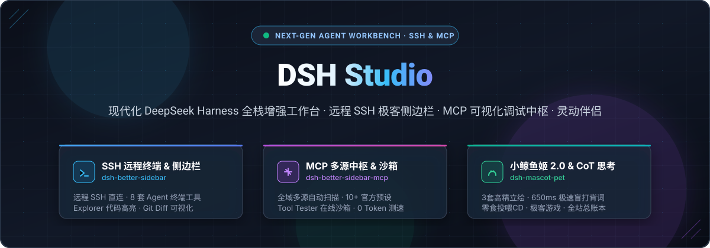
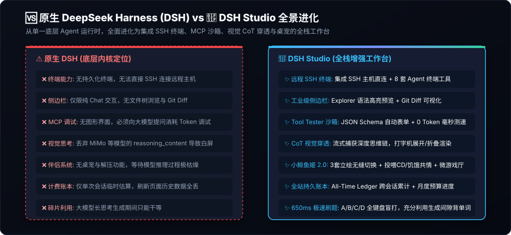
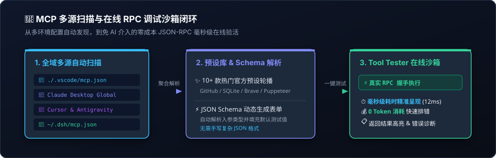
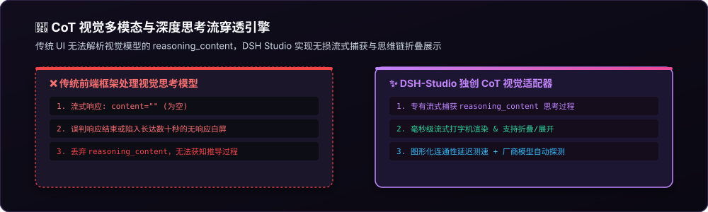
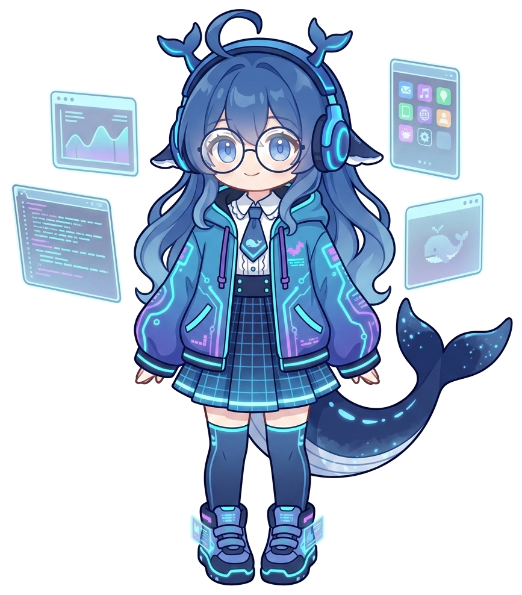
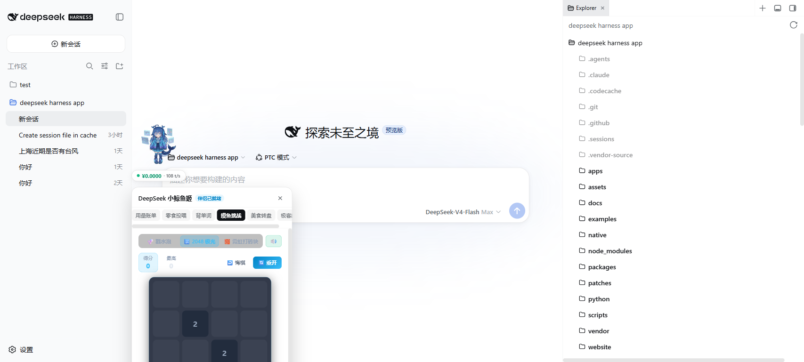
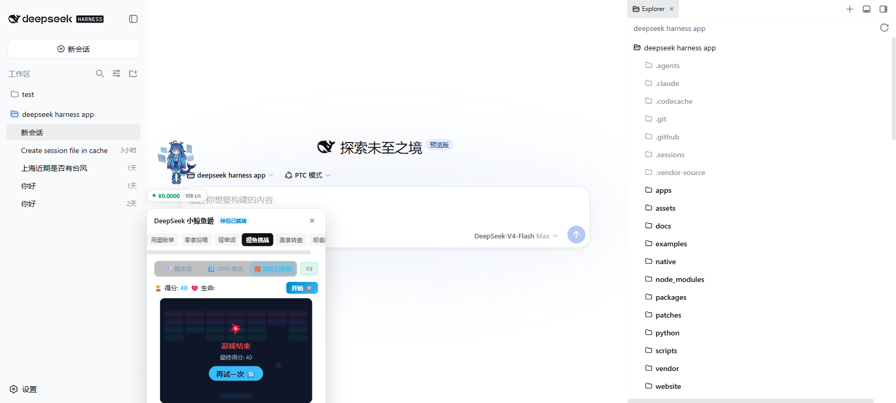
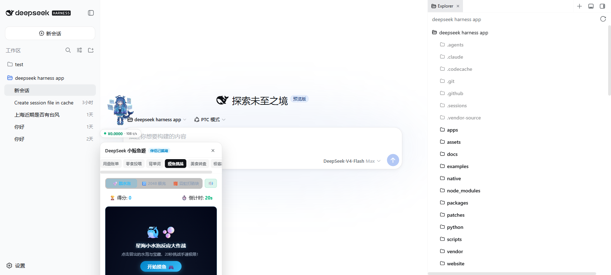
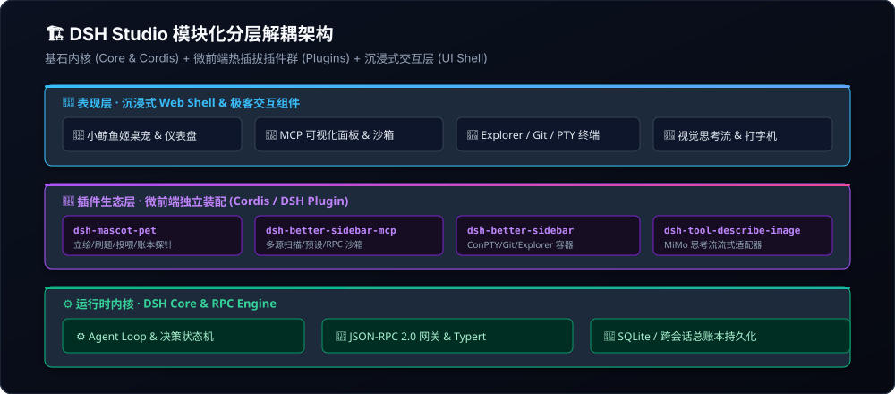

<p align="center">
  
</p>

<p align="center">
  <strong>🔥 Modern DeepSeek Harness Full-Stack Workbench · Remote SSH Geek Sidebar · Multi-Source MCP Debugging Hub · CoT Vision Engine · Geek Mascot Companion</strong>
</p>

<p align="center">
  <a href="README.md">简体中文</a> •
  <a href="README.en.md">English</a> •
  <a href="#-what-is-added-over-upstream-deepseek-harness-dsh">What's New</a> •
  <a href="#-competitive-matrix">Comparison</a> •
  <a href="#-core-feature-matrix">Features</a> •
  <a href="#-quick-start">Quick Start</a>
</p>

<p align="center">
  <a href="https://github.com/topics/dsh-plugin"></a>
  <a href="https://github.com/topics/dsh-better-sidebar"></a>
  <a href="https://github.com/topics/model-context-protocol"></a>
  <a href="https://github.com/topics/deepseek"></a>
  <a href="LICENSE"></a>
  
  
</p>

---

## 🆚 What is Added over Upstream DeepSeek Harness (DSH)?

While upstream **DeepSeek Harness (DSH)** provides the low-level Agent runtime loop and CLI kernel, **DSH Studio** is the **full-stack industrial-grade enhanced workbench and micro-frontend ecosystem**:

<p align="center">
  
</p>

| Dimension | Upstream DeepSeek Harness (DSH) | 🌟 **DSH Studio (Ours)** |
| :--- | :--- | :--- |
| **🌐 Remote SSH & Terminal** | ❌ Basic local subprocess only, no persistent terminal, no remote SSH | ✅ **Integrated Remote SSH Direct Connection & ConPTY / PTY Terminal**, multi-tab support & **8 Dedicated Agent Terminal Tools** |
| **🧰 IDE-Grade Workflow** | ❌ Chat-only conversation window, no file browsing or git diff | ✅ **Industrial Enhanced Sidebar**: Explorer syntax-highlighted code preview & search, Git branch switching, visual commit log & Diff |
| **🔌 MCP Discovery** | ❌ Manual single JSON file editing only | ✅ **All-Source Auto Discovery** (`.vscode`, Cursor, Claude, Antigravity) + 10+ Curated Official Presets Carousel |
| **🧪 MCP Online Sandbox** | ❌ None, requires prompting LLM with token cost | ✅ **Tool Tester Sandbox** (Schema form generation, 1-click test mock data, real RPC handshake & **0 Token Millisecond Latency Probe**) |
| **🧠 Visual CoT Reasoning** | ❌ Cannot stream multimodal `reasoning_content`, prone to blank screens | ✅ **Native CoT Vision Engine** (Stream-captures Xiaomi MiMo deep thinking chains with foldable typewriter rendering) |
| **🐬 Mascot Companion** | ❌ None, idle waiting during long generation | ✅ **Little Whale Maid 2.0** (3 HD skins + **650ms Speed CET-4 Blind Flashcards** + snack feeding CD system + retro mini-arcade) |
| **💰 Cost Transparency** | ⚠️ Single-session rough estimation only, lost on refresh | ✅ **All-Time Billing Ledger (Persistent)** + Real-time token bottom probe + Monthly dynamic budget progress bar |
| **🧩 Extensibility** | Static single-bundle composition | **Hot-pluggable Micro-frontend Plugins** + Drag-and-drop customizable sidebar card tabs |

---

## 📊 Competitive Matrix

| Dimension | Traditional Agent Client<br>*(Claude Desktop)* | Web Chat UI<br>*(LobeChat / Dify)* | AI Code Editor<br>*(Cursor / Continue)* | 🌟 **DSH-Studio**<br>*(Ours)* |
| :--- | :--- | :--- | :--- | :--- |
| **🌐 Remote SSH & Terminal** | ❌ No terminal / SSH | ❌ Chat-only interface | ⚠️ Editor terminal detached from Agent | ✅ **Integrated SSH Remote Sessions + 8 Agent Terminal Tools** |
| **🧰 All-in-One IDE Workflow** | ❌ No sidebar / file tree | ❌ Chat-only interface | ⚠️ Editor-bound, detached agent | ✅ **Industrial Sidebar** (Explorer preview + Git Diff + PTY Terminal) |
| **🔌 MCP Discovery** | ❌ Manual JSON file edits only | ⚠️ Heavy backend plugin setup | ⚠️ Single local config only | ✅ **All-Source Auto Discovery** (`.vscode`, Cursor, Claude, Antigravity) |
| **🧪 MCP Online Sandbox** | ❌ None, requires prompting LLM | ❌ No isolated tool tester | ❌ No single-tool testing UI | ✅ **Tool Tester Sandbox** (Schema form generation, 1-click test data, 0 token latency probe) |
| **🧠 Visual CoT Reasoning** | ❌ Cannot stream reasoning | ⚠️ Prone to blank screen/dropped tokens | ❌ General image input only | ✅ **Native CoT Vision Engine** (Stream-captures `reasoning_content` seamlessly) |
| **🐬 Mascot Companion** | ❌ Cold, static interface | ❌ None | ❌ None | ✅ **Little Whale Maid 2.0** (3 skins + empathy states + feeding CD + mini-games) |
| **⚡ Inference Downtime** | ❌ Idle waiting | ❌ None | ❌ None | ✅ **650ms Word Flashcards** (A/B/C/D keyboard blind-typing during generation gaps) |
| **💰 Cost Transparency** | ❌ No global ledger | ⚠️ Session-only estimation | ⚠️ Quota percentage only | ✅ **All-Time Billing Ledger** + Real-time token probes & monthly budget progress |

---

## 🌟 Core Feature Matrix

### 🧰 1. Industrial-Grade Enhanced Sidebar & Remote SSH Terminal (`dsh-better-sidebar`)

An all-in-one developer productivity suite for full-stack engineering and operations:

* **🌐 Remote SSH Sessions & Embedded Persistent PTY Terminal**:
  - Multi-tab terminal management (Local Bash / PowerShell / WSL / **Direct Remote SSH Host Sessions**);
  - Auto-reconnect and immersive full-screen terminal mode;
  - **8 Built-in Agent Terminal Tools**:
    `terminal_create`, `terminal_send`, `terminal_read`, `terminal_wait_for`, `terminal_resize`, `terminal_signal`, `terminal_close`, `terminal_list`,
    empowering autonomous AI agents to operate local and remote servers effortlessly.
* **📁 Explorer**:
  - Tree-structured workspace file navigation and fast search;
  - Real-time syntax-highlighted code previews (Rust, Go, Python, TypeScript, C++, SQL, YAML, JSON and 15+ languages).
* **🌿 Source Control (Git)**:
  - Branch switching and working directory state tracking;
  - Visual commit history inspection and file Diff highlighting with one-click revert.
* **🧩 Modular Tab Assembly**: Freely drag, reorder, and toggle tab cards in Settings > Sidebar Cards.

---

### 🔌 2. MCP Multi-Source Management & Online RPC Testing Sandbox (`dsh-better-sidebar-mcp`)

Click "MCP Management" in the sidebar to access full-suite configuration sniffing, 10+ official presets carousel, and the isolated **Tool Tester Online Sandbox**:

<p align="center">
  
</p>

* **Multi-Source Auto-Aggregation**: Automatically scans and detects workspace configs (`./mcp.json`, `.vscode/mcp.json`, `.cursor/mcp.json`, `.agents/mcp_config.json`) and global environments (Claude Desktop, Cursor, Antigravity/Gemini, `~/.dsh/mcp.json`).
* **Single Tool Online Testing Sandbox (Tool Tester Modal)**: Renders dynamic parameter forms from JSON Schema, populates default mock data with one click, **executes real JSON-RPC handshakes**, and displays millisecond latency and structured returns **with zero LLM token cost**.
* **10+ Curated Official Presets Carousel**: Built-in GitHub, SQLite, Web Fetch, Brave Search, Puppeteer, PostgreSQL, Memory, Filesystem, Everything, Git presets with horizontal scroll and quick switches.
* **Bulk JSON Import & Live Toggles**: Paste raw `mcpServers` JSON snippets for instant parsing and toggle servers on/off non-destructively.

---

### 🧠 3. CoT Visual Reasoning Stream Penetration Engine (`dsh-tool-describe-image`)

Engineered for multimodal vision models with deep thinking, unlocking loss-free reasoning chain streaming and network benchmarking:

<p align="center">
  
</p>

* **Chain of Thought (CoT) Compatibility**: Tailored for models with deep reasoning (e.g., Xiaomi MiMo). Even when initial stream `content` is empty, it parses `reasoning_content` without latency or timeout.
* **Graphical Connectivity Probing**: Measure endpoint round-trip times and automatically probe and list provider models.

---

### 🐬 4. Little Whale Maid 2.0 Geek Mascot & Companion (`dsh-mascot-pet`)

An interactive desktop companion docked to your workspace, fusing flashcard study, geek memes, snack feeding, and global billing ledgers:

#### 👗 3 High-Definition Seamless Skins
<table>
  <tr>
    <td align="center" width="33%">
      <br />
      <b>Classic Maid Outfit</b><br />
      <sub>Gentle &amp; Healing Companion</sub>
    </td>
    <td align="center" width="33%">
      <br />
      <b>Cyber Geek Mecha</b><br />
      <sub>Neon &amp; Hardcore Futuristic</sub>
    </td>
    <td align="center" width="33%">
      <br />
      <b>Summer Sailor Swimsuit</b><br />
      <sub>Refreshing &amp; Energetic Vibes</sub>
    </td>
  </tr>
</table>

* **CET-4 Vocabulary Speed Rush**:
  - Single-screen zero-scroll layout to maximize code generation downtime.
  - **650ms Auto-Advance on correct answers** with **A / B / C / D full keyboard blind-typing** and combo streaks.
* **Snack Feeding CD System & Hunger Empathy**:
  - 4 distinct snacks (Iced Cola, Hot Coffee, Donut, Energy Bar) with dynamic cooldowns (30s ~ 120s).
  - Affection score discounts + natural fullness decay (1 point every 2 minutes).
  - Fullness under 25% triggers hunger state and reminder dialogue bubbles.
* **All-Time Ledger & Real-Time Token Probes**:
  - Persistent `dsh_billing_ledger_v2` tracking cumulative usage across sessions.
  - Dual view displaying **Current Session Cost**, **All-Time Historical Total**, and **Monthly Budget Progress**.

#### 🎮 Geek Decompression Arcade
<table>
  <tr>
    <td align="center" width="33%">
      <br />
      <b>Geek Math · 2048</b>
    </td>
    <td align="center" width="33%">
      <br />
      <b>Retro Arcade · Breakout</b>
    </td>
    <td align="center" width="33%">
      <br />
      <b>Color Match · Bubble Shooter</b>
    </td>
  </tr>
</table>

---

## 🏗️ System Architecture

<p align="center">
  
</p>

```
dsh-studio/
├── packages/
│   ├── core/                   # DSH Agent Loop state machine and session runtime
│   ├── llm/                    # Multimodal LLM providers (DeepSeek / MiMo / OpenAI)
│   ├── typert/                 # Type graph generator & RPC runtime registry
│   └── host/                   # WebServer & micro-frontend host
├── plugins/                    # 🚀 Hot-pluggable micro-frontend plugins
│   ├── dsh-better-sidebar/     # Industrial sidebar (SSH, ConPTY terminal, Explorer, Git)
│   ├── dsh-better-sidebar-mcp/ # MCP multi-source scanner & RPC tester sandbox
│   ├── dsh-mascot-pet/         # Mascot 2.0, speed flashcards & all-time ledger
│   └── dsh-tool-describe-image/# CoT visual reasoning stream adapter
├── assets/readme/              # 📸 High-res showcase graphics & vector diagrams
└── docs/                       # Architecture specs, PRDs, and automated test reports
```

---

## 🚀 Quick Start

### Option 1: Standalone Workbench (Recommended)

Requires Node.js >= 22 and pnpm:

```bash
# 1. Clone this repository
git clone https://github.com/jiuge2467/dsh-studio.git
cd dsh-studio

# 2. Install dependencies and build
pnpm install
pnpm run build

# 3. Start Web Workbench (listens on 0.0.0.0:3080)
pnpm dsh web --host 0.0.0.0
```

Open `http://127.0.0.1:3080` in your browser to start exploring!

---

### Option 2: Add Plugins to Existing DSH Environment

```bash
# 1. Install Industrial Enhanced Sidebar (SSH & Terminal)
cd ~/.dsh && dsh plugin --profile web add dsh-better-sidebar

# 2. Install MCP Manager & Testing Sandbox
cd ~/.dsh && dsh plugin --profile web add dsh-better-sidebar-mcp

# 3. Install Little Whale Maid Mascot Companion
cd ~/.dsh && dsh plugin --profile web add dsh-mascot-pet
```

---

## 🧪 Automated Testing & Quality Gates

```bash
# Run full unit test suite
pnpm test

# Run mascot & billing ledger tests
pnpm --filter @deepseek-ai/dsh-mascot-pet test

# Run MCP manager unit tests
pnpm --filter dsh-better-sidebar-mcp test
```

> **Quality Metrics**:
> - Unit Test Pass Rate: **19/19 PASS (100%)**
> - TypeScript Strict Mode: **`strict: true` (0 compilation errors)**

---

## 📄 License

This project is licensed under the [MIT License](LICENSE).
