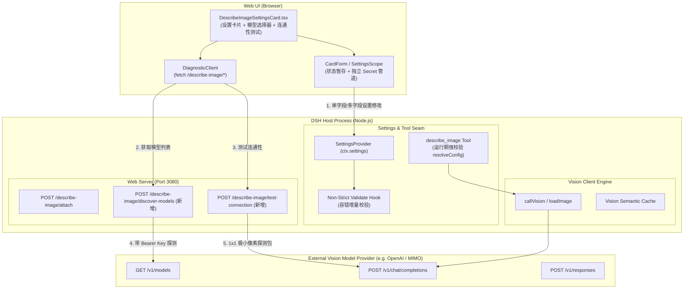

# 图像理解（describe_image）设置持久化与智能连通性技术架构规范 (Architecture Spec)

> **文档性质**：System Architecture & API Contract Specification
> **所属模块**：`@linxin666/dsh-tool-describe-image` (Client & Host)
> **当前阶段**：Phase 2: Arch & Contracts (ARCH)
> **版本**：v1.0.0

---

## 1. 系统架构设计与数据流拓扑



---

## 2. 核心架构缺陷根治方案 (Root Cause Resolutions)

### 2.1 校验生命周期解耦（Settings Validate vs Execution Resolve）
- **现状缺陷**：原 `installSettingsSection` 的 `validate` 钩子直接调用 `resolveConfig`，要求 `baseURL` 与 `model` 必须同时非空。在用户分步写入或增量修改时，触发“死锁式”报错。
- **架构方案**：
  - **设置层（Settings Layer）**：执行**字段级容错校验（Soft Format Validation）**——仅对已提供的字段校验格式（如 URL 是否以 http(s) 开头、数字是否为正整数），不强求跨字段必须全量就绪。
  - **运行与测试层（Runtime & Test Layer）**：执行**强一致性校验（Strict Complete Resolution）**——在 `describe_image.execute` 或 `/test-connection` 实际发起外部调用时，调用 `resolveConfig` 强制校验必要字段与凭据。

### 2.2 Secret 字段脱敏与回读判定解耦
- **现状缺陷**：`apiKey` 具有 `role('secret')` 属性，后端返回的脱敏视图中该字段被抹除，导致 `CardForm` 的 `userLayer()?.[field] === value` 判定失败。
- **架构方案**：
  - 在 `CardForm` 中维护 `secretFields` 注册表（`apiKey`）。
  - 对于 Secret 字段，`store` 成功返回后直接标记持久化完成，跳过前端明文一致性检查；
  - UI 显示 `[已设置]` 占位徽标与重置按钮。

---

## 3. 接口契约规范 (OpenAPI 3.0 Specification)

新增 2 个轻量诊断中继路由，统一挂载于 `ctx.webServer`。

### 3.1 模型列表发现路由 (`POST /describe-image/discover-models`)

```yaml
openapi: 3.0.3
info:
  title: Describe Image Diagnostic API
  version: 1.0.0
paths:
  /describe-image/discover-models:
    post:
      summary: 获取指定提供商端点的模型列表
      description: 安全中继请求 ${baseURL}/models 并过滤视觉模型推荐
      security:
        - LoopbackAuth: []
      requestBody:
        required: true
        content:
          application/json:
            schema:
              type: object
              required:
                - baseURL
              properties:
                baseURL:
                  type: string
                  example: "https://token-plan-cn.xiaomimimo.com/v1"
                apiKey:
                  type: string
                  description: 显式填写的 API Key（可选，优先使用）
                apiKeyEnv:
                  type: string
                  description: 引用的环境变量名称（可选，次优先）
                  default: "VISION_API_KEY"
      responses:
        '200':
          description: 探测结果
          content:
            application/json:
              schema:
                type: object
                required:
                  - ok
                properties:
                  ok:
                    type: boolean
                  models:
                    type: array
                    items:
                      type: object
                      required:
                        - id
                        - isVisionRecommended
                      properties:
                        id:
                          type: string
                          example: "mimo-v2.5-vl"
                        isVisionRecommended:
                          type: boolean
                          example: true
                  error:
                    type: string
                  statusCode:
                    type: integer
```

### 3.2 接口连通性一键测试 (`POST /describe-image/test-connection`)

```yaml
  /describe-image/test-connection:
    post:
      summary: 一键探测图像端点连通性与模型兼容性
      description: 发送 1x1 极小像素透明 PNG 图片探测包验证鉴权与模型响应
      security:
        - LoopbackAuth: []
      requestBody:
        required: true
        content:
          application/json:
            schema:
              type: object
              required:
                - baseURL
                - model
              properties:
                baseURL:
                  type: string
                model:
                  type: string
                apiKey:
                  type: string
                apiKeyEnv:
                  type: string
                apiStyle:
                  type: string
                  enum: [chat-completions, responses]
                  default: chat-completions
                timeoutMs:
                  type: integer
                  default: 15000
      responses:
        '200':
          description: 诊断报告
          content:
            application/json:
              schema:
                type: object
                required:
                  - ok
                  - latencyMs
                properties:
                  ok:
                    type: boolean
                  latencyMs:
                    type: integer
                    example: 356
                  text:
                    type: string
                    example: "Ping OK"
                  statusCode:
                    type: integer
                    example: 200
                  error:
                    type: string
                  errorCode:
                    type: string
                    example: "DESC-DIAG-401"
```

---

## 4. 统一错误码规范与防御架构

统一错误码格式：`<域><层级><序号>`

| 错误码 | 错误类型 | 触发条件 | UI 友好提示与排查建议 |
|:---|:---|:---|:---|
| **`DESC-VAL-001`** | 参数格式错误 | `baseURL` 不是合法的 http(s) URL | 请输入以 http:// 或 https:// 开头的有效接口地址 |
| **`DESC-VAL-002`** | 必要参数缺失 | 连通性测试时未填写 Model ID | 请先填写或选择目标视觉模型 ID |
| **`DESC-AUTH-001`** | 鉴权密钥缺失 | 未填写 apiKey 且环境变量未设置 | 未找到有效 API Key，请填写密钥或配置环境变量 |
| **`DESC-DIAG-401`** | 鉴权失败 | 远端端点返回 HTTP 401 Unauthorized | [401 鉴权失败] API Key 无效或已过期，请检查密钥 |
| **`DESC-DIAG-404`** | 地址不存在 | 远端端点返回 HTTP 404 Not Found | [404 路由不存在] 请确认接口地址是否包含 /v1 后缀 |
| **`DESC-DIAG-400`** | 模型参数错误 | 远端端点返回 HTTP 400 Bad Request | [400 参数错误] 当前模型可能不支持图像输入或协议不匹配 |
| **`DESC-NET-TIMEOUT`**| 网络超时 | 探测请求超过设定 timeoutMs（默认15s）| [网络超时] 目标端点响应超时，请检查网络或代理设置 |

### 4.1 安全防御铁律（Security Guards）
1. **仅允许本地回环访问（Loopback Guard）**：所有 `/describe-image/*` 路由强制校验 `request.socket.remoteAddress`，仅允许 `127.0.0.1` / `::1` 访问，拒绝公网直连。
2. **禁止重定向跟随（Anti-SSRF & Credential Leak）**：Fetch 客户端设置 `redirect: 'error'` / `manual`，防止恶意服务端 302 重定向窃取 Bearer API Key。
3. **Secret 绝不落盘日志**：诊断探测的调试日志中，对 `authorization` 标头进行 `sk-***` 掩码脱敏。

---

## 5. 前端组件分层与状态机设计

```
DescribeImageSettingsCard (卡片容器)
├── ValueField (baseURL - 接口地址)
├── ModelCombobox (model - 模型选择与动态拉取)
│   ├── Input (手动输入)
│   ├── Button (🔄 获取模型列表)
│   └── Dropdown (推荐视觉模型列表)
├── ChoiceField (apiStyle - 协议选择)
├── ValueField (apiKey - Secret 密钥)
├── ValueField (apiKeyEnv - 环境变量名)
├── AdvancedAccordion (折叠高级参数)
│   ├── ValueField (defaultPrompt)
│   ├── ValueField (maxBytes)
│   ├── ValueField (maxOutputTokens)
│   └── ValueField (timeoutMs)
└── CardFooter (底部状态与操作栏)
    ├── TestConnectionSection
    │   ├── Button (⚡ 测试连通性)
    │   └── StatusBadge (Idle / Testing / Success / Error)
    └── ActionButtons ([放弃修改] / [保存])
```

---

## 6. Spec 锁定清单（Phase 2 Gate）

| 模块 | 文件路径 | 变更类型 | 核心责任 |
|:---|:---|:---|:---|
| **Host 配置校验** | `packages/dsh-tool-describe-image/src/index.ts` | `[MODIFY]` | 改造 `validate` 为容错增量校验 |
| **Host 诊断路由** | `packages/dsh-tool-describe-image/src/attach-routes.ts` | `[MODIFY]` | 挂载 `discover-models` 与 `test-connection` 路由 |
| **Client 表单驱动** | `packages/dsh-tool-describe-image/src/client/settings-form.ts` | `[MODIFY]` | 适配 Secret 字段独立存储与免脱敏比对 |
| **Client 卡片组件** | `packages/dsh-tool-describe-image/src/client/DescribeImageSettingsCard.tsx` | `[MODIFY]` | 增加模型获取下拉、测试连通性按钮与状态条 |
| **Client 样式规范** | `packages/dsh-tool-describe-image/src/client/settings-card.module.css` | `[MODIFY]` | 增加连通性徽标、加载指示器与下拉菜单样式 |
| **多语言本地化** | `packages/dsh-tool-describe-image/src/client/locales.ts` | `[MODIFY]` | 补充模型发现与连通性测试的所有中英文文案 |
| **自动化单测套件**| `packages/dsh-tool-describe-image/tests/settings.spec.ts` | `[MODIFY]` | 增加增量保存、模型获取与诊断路由测试用例 |
