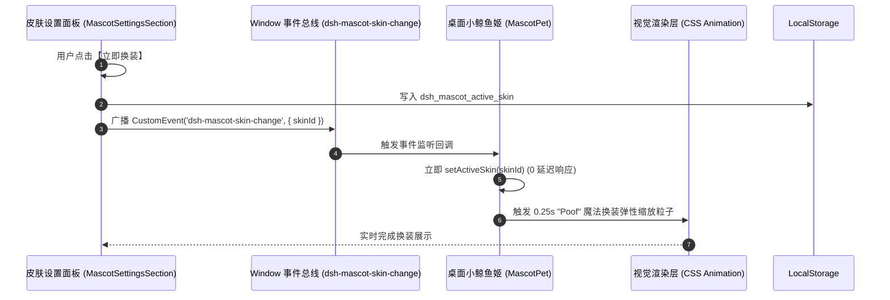

# 小鲸鱼姬 2.0 视觉精修、即时换装与灵动步态系统详细方案 (Mascot Improvement & Locomotion Proposal)

> **文档性质**：视觉规范重构 · 响应式通信协议 · 精灵步态动力学方案
> **责任角色**：🎨 视觉设计师 & 🏗️ 架构师 & 💻 资深动效工程师
> **适用模块**：`dsh-mascot-pet`

---

## 一、 皮肤立绘全身重构与瑕疵精修方案 (Issue 1)

### 1.1 现状与缺陷根因分析
1. **赛博极客 & 夏日水手**：
   - 之前截取的立绘主要集中在腰部以上，导致大腿以下被生硬裁切，没有画出双腿和小鞋子；
   - 边缘残留有原本参考图中的书本、沙滩背景等方块杂色。
2. **经典女仆装（Happy 状态立绘）**：
   - 顶部发箍顶端被截平；
   - 脚底下残留了一道原本 UI 边框的深蓝色水平细条，影响整体美感。

### 1.2 改造实施方案
- **统一 Q 版全身标准 (Full-Body Chibi Standard)**：
  - **头部**：完整保留头顶发箍、呆毛天线、耳鳍与蓬松发丝，顶部留有 6px 透明呼吸区，杜绝切边。
  - **身躯与尾巴**：保留服装特色（女仆围裙、极客卫衣与光子悬浮屏、水手服与柠檬饮品）及标志性深海鲸鱼大尾巴。
  - **下肢与双脚**：全部采用 **全身完整立绘**，绘制白丝/短袜与精致小靴子，双脚完整露出并形成自然站立姿态。
  - **背景与杂色净化**：100% 纯透明 Alpha 通道，彻底剔除书本、沙滩、底边蓝色残线等所有杂物。

---

## 二、 一键换装 0 延迟即时生效方案 (Issue 2)

### 2.1 根因剖析
- 皮肤设置组件 `MascotSettingsSection` 位于 DSH 设置弹窗内（独立 React 子树），切换皮肤时仅执行了 `localStorage.setItem('dsh_mascot_active_skin', id)`；
- 桌面悬浮宠 `MascotPet` 是挂载在 DOM Root 的独立组件，未订阅该 Storage 变更，导致必须刷新页面重新加载 state。

### 2.2 跨组件即时响应协议 (Instant Hot-Switching Protocol)


- **实现细节**：
  1. `MascotSettingsSection.tsx`：点击换装时调用 `window.dispatchEvent(new CustomEvent('dsh-mascot-skin-change', { detail: { skinId } }))`；
  2. `MascotPet.tsx`：`useEffect` 监听 `dsh-mascot-skin-change` 与 `storage` 事件，收到后立即更新 state 并触发欢快变装反馈。

---

## 三、 灵动精灵步态动力学系统 (Alive Locomotion System) (Issue 3)

### 3.1 市面竞品调研与技术对比
| 方案类型 | 代表产品 | 核心原理 | 优缺点与适配评估 |
| :--- | :--- | :--- | :--- |
| **纯平移位移 (Basic Transform)** | 传统简易桌宠 | 仅改变 `left/top` 坐标，身体静止平移。 | ❌ 呆板僵硬，像纸片滑动。 |
| **Live2D / 骨骼蒙皮** | 天选姬 / 桌面挂件 | 复杂的 2D 骨骼网格变形。 | ⚠️ 体积庞大（几十MB），依赖 WebGL，开发周期极长。 |
| **步态动力学调制 (Gait Locomotion)** ⭐ | **VSCode-Pets / Tamago-AI** | **速度矢量实时解耦 + 正弦踏步起伏 + 身体重心晃动 + 果冻减震**。 | ✅ **极致轻量（0额外资源）、丝滑灵动、响应极快、视觉效果极佳！** |

### 3.2 步态运动合成模型 (Locomotion Mathematical Model)
在小鲸鱼姬移动与漫步时，我们采用 **4 维动力学叠加引擎**：

```
                    ┌── 1. 左右踩踏摆动: wobbleAngle = sin(2π * f * t) * 5°
                    ├── 2. 垂直弹跳起伏: stepHop = -|sin(2π * f * t)| * 4px
身体总变换 Matrix ──┼── 3. 迎风前倾角度: leanAngle = sign(vx) * min(3°, |vx| * 1.5°)
                    └── 4. 落地刹车减震: squashStretch = scale(1.06, 0.94) (在移动停止瞬间)
```

1. **脚步交替踩踏感 (Step Wobble)**：
   - 移动时身体围绕底部中心点（`transform-origin: 50% 90%`）进行 `±5deg` 规律性左摇右摆，模拟左右脚交替踏步。
2. **轻快弹跳踏步起伏 (Bouncy Stepping)**：
   - 每踏一步向上轻跃 `3~4px`，落地时微沉，呈现 Q 萌小精灵欢快小跑的节奏感。
3. **迎风冲刺微前倾 (Inertial Lean)**：
   - 向右跑时身体向右微前倾 `+3deg`，向左跑时向左微前倾 `-3deg`，具有真实的惯性阻力感。
4. **刹车微蹲弹性缓冲 (Braking Cushion)**：
   - 从移动停下回到 idle 的瞬间，叠加 0.2s 的微蹲回弹动效，赋予小鲸鱼姬如同真实生命般的肌肉张力。

---

## 四、 实施计划与里程碑 (Execution Roadmap)

1. **Step 1 (视觉层修复)**：
   - 制作三套 100% 全身立绘（女仆装 Happy 瑕疵修复、极客全身透明画、水手全身透明画）；
   - 更新 Base64 与素材静态表。
2. **Step 2 (通信层修复)**：
   - 接入跨组件 `dsh-mascot-skin-change` 事件总线，实现换装 0 延迟秒级响应。
3. **Step 3 (步态引擎升级)**：
   - 升级 `MascotWanderEngine` 与 CSS 步态类（`css.walkingGait`、`css.landingCushion`），联动速度矢量与步频变换。
4. **Step 4 (全流程自动化验证)**：
   - 编译构建并在真实浏览器中运行 Playwright Subagent 录制验证。
