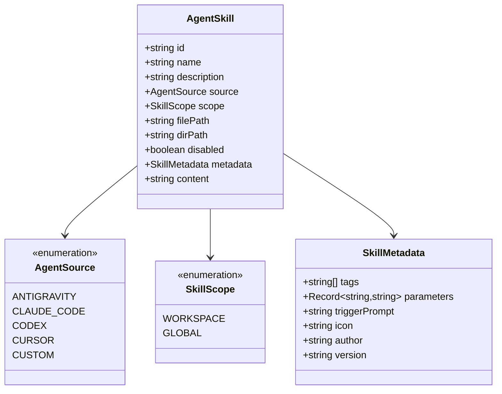

# Architecture Design: DSH Better-Sidebar Agent 技能与规则工作台 (dsh-better-sidebar-skills)

> **文档版本**：v1.0.0 (Phase 2: Arch & DB)  
> **责任角色**：🏗️ ARCH（系统架构师）  
> **状态**：Spec 已锁定，待评审进入 DEV 阶段  

---

## 1. 系统总体架构与分层设计

本项目遵循 **DeepSeek Harness (Cordis) 插件规范** 与 **`dsh-better-sidebar` 服务化契约**，采用 **Host (Node.js) / Client (React 18)** 双半解耦架构：

```mermaid
graph TD
    subgraph Browser Client [Client Half: Browser (React 18 + BetterSidebar)]
        UI[SkillsView / Tab] --> State[useSkillsState Hook & Store]
        State --> Filter[Category & Search Filter]
        State --> API_Client[Skills API Client]
        UI --> BetterSidebarSvc[ctx.betterSidebar Service]
        BetterSidebarSvc --> TabReg[registerTab: dsh-skills:manager]
        BetterSidebarSvc --> EditorLink[openFile -> CodeMirror Editor]
    end

    subgraph DSH WebServer [Host Half: Node.js (Cordis WebServer / Sidebar API)]
        Router[/sidebar/api/skills/* & /api/skills/*]
        Router --> AuthFence[Host-Header Trust Fence]
        AuthFence --> Scanner[Multi-Agent Skill Scanner]
        Scanner --> WorkspaceScan[Workspace Scanner: .agents/.claude/.codex/.cursor]
        Scanner --> GlobalScan[Global Home Scanner: ~/.gemini/config/skills, ~/.claude]
        Scanner --> Parser[YAML Frontmatter & Markdown Parser]
        Router --> Writer[Skill File Scaffolder / Writer]
    end

    API_Client -- JSON POST (fetch) --> Router
```

---

## 2. 技术选型矩阵 (Technology Stack)

| 层次 | 选型组件 | 精确版本 / 规范 | 选型决策理由 |
| :--- | :--- | :--- | :--- |
| **基础微内核** | `@deepseek-ai/cordis` / `cordis` | `^4.0.0-rc.7` | DSH 官方插件驱动内核，支持 `ctx.effect` 生命周期与依赖注入 |
| **扩展基座** | `dsh-better-sidebar` | `^0.12.0` | 依赖其 `ctx.betterSidebar` 暴露的 `registerTab`、`badge`、`pluginToggles` |
| **客户端视图** | `React` + `Lucide-React / SVG` | `18.2.0` | 与 DSH Web UI 同源，零额外繁重 UI 库，纯 CSS 模块化自适应 |
| **构建与打包** | `tsdown` + `rolldown` | `^0.22.14` | DSH 标准打包器，生成 ESM host (`lib/index.js`) 与 CJS client (`lib/client.js`) |
| **类型系统** | `TypeScript` | `^5.6.0` (Strict) | 全面类型声明，`import type {} from 'dsh-better-sidebar'` 零 Node 污染 |
| **测试框架** | `vitest` | `^4.1.8` | 单元测试覆盖扫描器、Frontmatter 解析与边界注入 |

---

## 3. 目录工程树规划 (Project Layout)

```
dsh-better-sidebar-skills/
├── package.json                   # 插件元数据（dsh.bundle.patch + dsh.client.inject）
├── cordis.patch.yml               # Cordis 挂载 patch 定义
├── tsconfig.json                  # TS 根配置 (ESNext, React JSX, NodeNext)
├── tsconfig.build.json            # 编译输出专用配置
├── tsdown.config.ts               # 构建脚本 (双半产物分发)
├── api/
│   └── openapi.yaml               # OpenAPI 3.0 接口契约
├── src/
│   ├── index.ts                   # Host 半入口：注册 /sidebar/api/skills/* 路由与工具
│   ├── types.ts                   # 领域模型与 DTO 核心类型 (AgentSkill, SkillSource, etc.)
│   ├── scanner/
│   │   ├── scanner.ts             # 多 Agent 路径嗅探引擎 (Workspace + Global)
│   │   ├── parser.ts              # YAML Frontmatter 健壮容错解析器
│   │   └── templates.ts           # 标准 SKILL.md 脚手架模板
│   └── client/
│       ├── index.tsx              # Client 半入口：注册 Tab、Badge、生命周期
│       ├── api.ts                 # 前端 API 客户端封装
│       ├── types.ts               # 客户端 UI 状态接口
│       ├── state.ts               # 状态管理 Hook (SWR 风格异步缓存与刷新)
│       ├── styles.module.css      # 继承 better-sidebar 风格的深浅色变量与动效
│       └── components/
│           ├── SkillsView.tsx     # 主 Tab 视图
│           ├── SkillCard.tsx      # 技能卡片组件 (带 Agent 标识与快捷操作)
│           ├── SkillDetail.tsx    # 技能详情抽屉/模态窗
│           ├── NewSkillModal.tsx  # 新建技能向导弹窗
│           └── FilterBar.tsx      # 分类筛选与搜索条
└── tests/
    ├── parser.spec.ts             # Frontmatter 解析与异常注入测试
    ├── scanner.spec.ts            # 多目录扫描与 glob 过滤测试
    └── service-mock.spec.ts       # 侧边栏服务注册与生命周期单测
```

---

## 4. 领域数据模型 (Domain Model & ER)



---

## 5. 多 Agent 扫描规则与识别拓扑

| Agent 品牌 | 作用域 (Scope) | 扫描规则路径 (Glob Patterns) | 结构特征 |
| :--- | :--- | :--- | :--- |
| **Antigravity (AGY)** | Workspace | `.agents/skills/*/SKILL.md`<br>`.agents/rules/*.md` | YAML Frontmatter (`name`, `description`) + Markdown |
| | Global | `~/.gemini/config/skills/*/SKILL.md`<br>`~/.gemini/config/rules/*.md` | 同上 |
| **Claude Code** | Workspace | `.claude/skills/*/SKILL.md`<br>`.claude/rules/*.md`<br>`CLAUDE.md` | Frontmatter 或 Markdown 标题提取 |
| | Global | `~/.claude/skills/*/SKILL.md`<br>`~/.claude/rules/*.md` | 全局常用技能库 |
| **Codex / OpenAI** | Workspace | `.codex/skills/*/SKILL.md`<br>`.codex/rules/*.md` | 标准 Agent 技能规范 |
| **Cursor / Rules** | Workspace | `.cursorrules`<br>`.cursor/rules/*.mdc`<br>`AGENTS.md` | 单文件规则或 MDC 结构化规则 |

---

## 6. 安全边界与沙箱契约 (Security Fence)

1. **Host-Header Trust Fence**：后端路由校验与 DSH 保持一致，仅响应 Loopback (`127.0.0.1`, `localhost`) 及经授权的 `trustedHosts`。
2. **Path Traversal 防御**：所有涉及文件读写/创建的路径，均通过 `isWithin(targetPath, allowedRoots)` 强校验，严禁越界读写。
3. **Client 纯度与零 Node 污染**：客户端代码全部使用 `import type {}` 引用类型，打包后无任何 Node.js 原生包依赖，完全符合 DSH 纯浏览器沙箱安全准则。

---

## 7. Spec 锁定表 (Specification Lock)

- [x] **Tab ID**: `dsh-skills:manager`
- [x] **Tab Order**: `45`（紧跟在 Terminal 之后，在 Browser 之前）
- [x] **API 命名空间**: `/sidebar/api/skills.list`, `/sidebar/api/skills.create`, `/sidebar/api/skills.toggle`
- [x] **配置持久化**: 挂载至 `pluginSettings['dsh-skills:manager']`
- [x] **退出门禁**: Spec 锁定完毕，经确认即可直接进入 DEV 实施。
