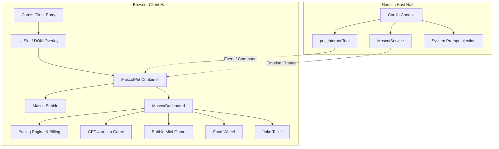

# dsh-mascot-pet 系统架构设计

```mermaid
flowchart TB
    subgraph DSH_Host [Node.js Host Half]
        A[Cordis Context] --> B[MascotService]
        A --> C[pet_interact Tool]
        A --> D[System Prompt Injection]
    end

    subgraph DSH_Client [Browser Client Half]
        E[Cordis Client Entry] --> F[UI Slot / DOM Overlay]
        F --> G[MascotPet Container]
        G --> H[MascotBubble]
        G --> I[MascotDashboard]
        I --> J1[Pricing Engine & Billing]
        I --> J2[CET-4 Vocab Game]
        I --> J3[Bubble Mini-Game]
        I --> J4[Food Wheel]
        I --> J5[Joke Teller]
    end

    C -.->|Event / Command| G
    B -.->|Emotion Change| G
```

- **单向依赖原则**：Host 端纯服务注册，Client 端自包含视图与计算引擎；
- **Cordis 生命周期**：`apply(ctx)` 返回所有 Disposers 闭包，卸载时干净退出。
